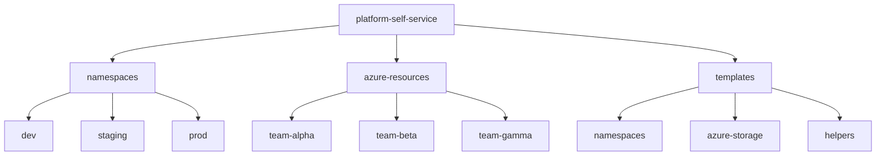

# Self-Service Platform Templates

This directory contains templates for requesting platform resources. Developers use these templates to quickly generate properly formatted resource requests.

## Available Templates

### Namespace Request (`namespaces/namespace-template.yaml`)
Request a Kubernetes namespace with resource quotas and limits.

**Required values:**
- `TEAM_NAME`: Your team name (lowercase, no spaces)
- `ENVIRONMENT`: dev, staging, or prod
- `CONTACT_EMAIL`: Team contact email
- `PURPOSE`: What the namespace will be used for
- `CPU_CORES`: Number of CPU cores (1, 2, 4, 8)
- `MEMORY_GB`: Memory in GB (2, 4, 8, 16)
- `DATE`: Request date (YYYY-MM-DD)

### Azure Storage Request (`azure-storage/storage-template.yaml`)
Request an Azure Storage Account for your team.

**Required values:**
- `TEAM_NAME`: Your team name
- `ENVIRONMENT`: dev, staging, or prod
- `STORAGE_NAME`: Globally unique storage name (3-24 chars, lowercase alphanumeric)
- `PURPOSE`: What the storage will be used for
- `AZURE_REGION`: swedencentral, westeurope, or northeurope
- `SKU`: Standard_LRS or Standard_GRS
- `DATE`: Request date (YYYY-MM-DD)

**File Location**: `azure-resources/{TEAM_NAME}/{STORAGE_NAME}.yaml`

## How to Use Templates

### Manual Method
1. Copy the appropriate template file
2. Replace all `{{PLACEHOLDERS}}` with your actual values
3. Save to the correct directory
4. Commit and push to create a PR
5. Wait for PR approval and merge
6. ArgoCD will automatically sync the resources

### Using Helper Scripts (see Part 2)
Use the provided scripts to interactively generate YAML from templates.

## Directory Structure

**Note**: Azure resources are organized by team name under `azure-resources/`, where each team has their own directory containing their YAML resource definitions.

## Support

For questions or issues, contact the platform team or consult LAB04A documentation.
